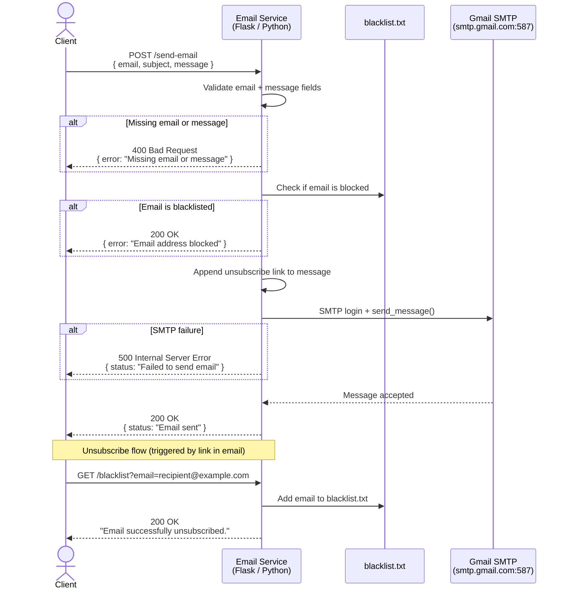

# Email Microservice

## Description

This microservice sends emails on behalf of your application using Gmail's SMTP server. It accepts a recipient address, subject, and message body, and automatically appends an unsubscribe link to every email sent. It also manages a blacklist — any address that unsubscribes is permanently blocked from receiving future emails.

---

### Base URL

```
http://3.129.216.60:3002
```

---

## Requesting Data

### Send an email

Send an HTTP `POST` request to `/send-email` with a JSON body.

**Endpoint:** `POST /send-email`

**Headers:**
```
Content-Type: application/json
```

**Request Body:**

| Field | Type | Required | Description |
|---|---|---|---|
| `email` | string | ✅ Yes | Recipient email address |
| `subject` | string | No | Subject line of the email |
| `message` | string | ✅ Yes | Body text of the email |

**Example request (JavaScript `fetch`):**

```javascript
const response = await fetch("http://3.129.216.60:3002/send-email", {
  method: "POST",
  headers: { "Content-Type": "application/json" },
  body: JSON.stringify({
    email: "recipient@example.com",
    subject: "Hello from the app",
    message: "This is your notification message."
  })
});

const data = await response.json();
```

**Example request (`curl`):**

```bash
curl -X POST http://3.129.216.60:3002/send-email \
  -H "Content-Type: application/json" \
  -d '{"email": "recipient@example.com", "subject": "Hello", "message": "Your message here."}'
```

---

### Unsubscribe an email address

Adds an email address to the blacklist. This is called automatically via the unsubscribe link appended to every outgoing email, but can also be called directly.

**Endpoint:** `GET /blacklist?email={address}`

**Example request:**

```javascript
await fetch("http://3.129.216.60:3002/blacklist?email=recipient@example.com");
```

```bash
curl "http://3.129.216.60:3002/blacklist?email=recipient@example.com"
```

---

## Receiving Data

### Send email response — HTTP 200:

| Field | Type | Description |
|---|---|---|
| `status` | string | Confirmation message |

**Example success response:**

```json
{ "status": "Email sent" }
```

### Error responses:

| HTTP Status | Cause | Example body |
|---|---|---|
| `400 Bad Request` | Missing `email` or `message` field | `{"error": "Missing email or message"}` |
| `500 Internal Server Error` | Gmail SMTP failure | `{"status": "Failed to send email"}` |

> **Note:** Sending to a blacklisted address returns HTTP 200 with `{"error": "Email address blocked"}` — it does not throw a 4xx error.

### Unsubscribe response — HTTP 200:

Returns a plain text confirmation:

```
Email successfully unsubscribed.
```

---

## UML Sequence Diagram



---

## Running the Service

**Requirements:** Python 3, Flask, a Gmail account with an [App Password](https://support.google.com/accounts/answer/185833)

```bash
pip install flask
python mailservice.py
```

Service runs on port `3002`. To run locally instead of on the EC2 server, swap the `app.run` line in `mailservice.py`:

```python
# app.run(host='0.0.0.0', port=3002, debug=True)  # EC2
app.run(port=3002, debug=True)                      # local
```

**Health check:**
```bash
curl -X POST http://3.129.216.60:3002/send-email \
  -H "Content-Type: application/json" \
  -d '{"email": "test@example.com", "message": "ping"}'
```

